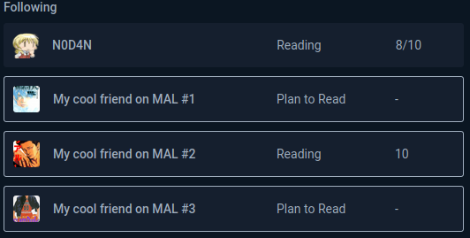

# AniMALFriendsScores

### Summary  
Small **unofficial** browser extension for showing scores from your friends MyAnimeList account on AniList anime or manga pages.

### Installation  
* Firefox   
  Extension is available on [Mozilla addon page](https://addons.mozilla.org/en-US/firefox/addon/animalfriendsscores/).
    

* Chrome  
  I don't use Chrome or Chromium, so I don't have any plans on publishing it to chrome extensions store.
  1. Go to [releases page](https://github.com/N0D4N/AniMALFriendsScores/releases/latest).  
  2. Download `Source code.zip`
  3. Unzip it.
  4. Open `chrome://extensions/`
  5. Enable developer mode
  6. Click on `Load unpacked` button  
  7. Select `src` subfolder of folder where you unzipped `Source code.zip`
  8. You are done.
    
### How it looks like?
Scores from MyAnimeList friends have thin white border around them.
  
Names were changed, in a browser your friends usernames names will be displayed correctly.

## DISCLAIMER
AniMALFriendsScores is not affiliated with MyAnimeList.net or Anilist.co

## LICENSE
AniMALFriendsScores uses MIT license. See LICENSE file for more details.
